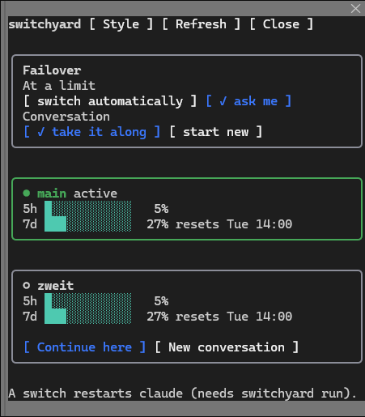
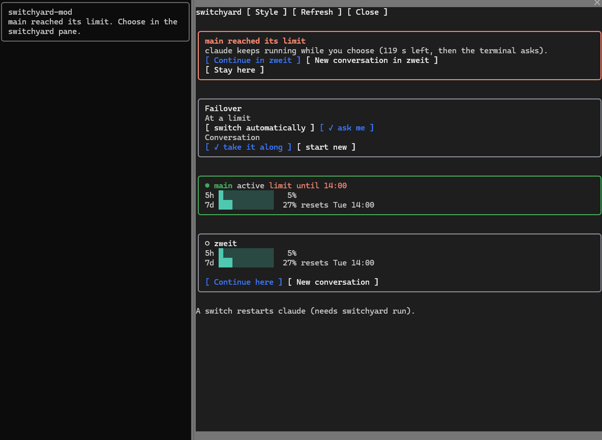

# switchyard

[](https://github.com/LuGG000/switchyard/actions/workflows/ci.yml)
[](https://github.com/LuGG000/switchyard/releases/latest)
[](LICENSE)

Open-source account switcher with limit failover for Claude Code subscription
logins (Pro/Max). Keep several of your own logins as profiles; when one hits its
usage limit, switchyard continues the conversation in the next one.

**Status: early development.** Profiles, switching, `run`, the failover (headless and interactive)
and the mod have been used with the real `claude` on Windows. A real usage limit has not been
observed yet, so the limit detection is tested with simulated limits only. Linux and macOS are
built and tested in CI; see [Scope](#scope) for what is verified where.

## How it works

- A **profile** is a Claude config directory with its own login. switchyard
  starts `claude` with that profile's `CLAUDE_CONFIG_DIR`; it never reads, copies,
  logs or sends credentials.
- Profiles share `projects/`, settings, skills and the other entries listed in
  `link` (config) with your default `~/.claude` through symlinks (junctions on
  Windows), so a conversation can be resumed in another profile.
- `switchyard run` injects a status line and hooks per run with `--settings`
  (your own Claude settings are never changed). They record usage per profile and
  report a limit.
- At a limit (or when `proactive_threshold` is reached) the launcher ends `claude`
  and starts it again in the next profile, continuing the conversation when
  `carry_context` is on. Headless runs (`run -- -p "prompt"`) fail over the same way.

## Quick start

Install switchyard (next section), then:

```
switchyard init                        # config; offers your existing ~/.claude login as the first profile
switchyard add second                  # log in a second account
eval "$(switchyard shell-init bash)"   # optional, in your shell startup file: a plain `claude` goes through switchyard
switchyard run                         # start claude with failover
switchyard mod install                 # optional: the /switchyard pane inside claude
```

What happens at a limit is set with `switchyard config set mode ask|auto` (see [Configuration](#configuration)).

## Install

You need Claude Code (`claude` on your `PATH`, tested with 2.1.296) and a Pro or Max login for each account, on Windows, Linux or macOS (see [Scope](#scope)); Go 1.26 or newer only to build from source. A step-by-step guide from install to removal is in [docs/SETUP.md](docs/SETUP.md).

From source (Go 1.26 or newer):

```
go install github.com/LuGG000/switchyard/cmd/switchyard@latest
```

Or download the archive for Linux, macOS or Windows (amd64, arm64) from the
[releases page](https://github.com/LuGG000/switchyard/releases), unpack it and put
`switchyard` on your `PATH`. Linux releases also ship `.deb` and `.rpm` packages, and
`packaging/aur/PKGBUILD` (from source) and `packaging/aur-bin/PKGBUILD` (prebuilt) are the Arch recipes.
`claude` must be installed and on the `PATH`.

### Verify a download

Each release has `checksums.txt` with the SHA-256 of every file and a keyless
[cosign](https://github.com/sigstore/cosign) signature of it, made by the release workflow.

```
cosign verify-blob checksums.txt --bundle checksums.txt.sigstore.json \
  --certificate-identity-regexp '^https://github.com/LuGG000/switchyard/\.github/workflows/release\.yml@refs/tags/v' \
  --certificate-oidc-issuer https://token.actions.githubusercontent.com
sha256sum --check --ignore-missing checksums.txt
```

`switchyard update --install` checks the archive against `checksums.txt` of the same release
but does not verify the signature itself.

## Usage

```
switchyard init                       # create the default config.toml
switchyard add work1                  # create a profile and log it in
switchyard add main --existing        # use your existing ~/.claude login as a profile, no new login
switchyard list                       # profiles and their login state
switchyard status [--json]            # active profile, last use, cooldowns
switchyard status --short             # one line for a shell prompt or tmux: main 5h 33% 7d 19%
switchyard run                        # run claude with the active profile (options go after --, e.g. run -- --model opus)
switchyard run -- -p "prompt"         # headless run that fails over at a limit
switchyard run --wait -- -p "prompt"   # the same, and wait for the first reset if every profile is at its limit
switchyard switch work2 --resume      # switch and continue the current conversation
switchyard switch work2 --fresh       # switch and start a new conversation
switchyard switch work2 --no-launch   # only change the active profile
switchyard handoff work2              # ask the running session to continue in work2
switchyard decision                   # the limit that waits for the mod's buttons (used by the mod)
switchyard config                     # failover settings
switchyard config set mode auto       # switch at a limit without asking
switchyard config colors dark         # colors of the mod pane: default, dark or light
switchyard mod install                # install the optional Claude Code mod
switchyard login work1                # log a profile in again
switchyard remove work1               # remove a profile (asks first; --yes skips the question)
switchyard update                     # check for a newer release
switchyard update --install           # download and install it
switchyard repair                     # re-create the shared links
switchyard doctor                     # check logins, settings and links
switchyard shell-init bash            # a claude function that always starts through switchyard
```

Without `--resume` or `--fresh`, `carry_context` decides. Carrying the context
makes the new account process it again with a cold prompt cache, and it counts
against that account's limit.

### Your existing login

If you already use claude, `switchyard init` finds the subscription login in `~/.claude` and offers it
as the first profile; `switchyard add main --existing` does the same later. Nothing is copied and
there is no new login: the profile is a link to that directory, so a plain `claude` and switchyard
share the same sessions and settings. Add further accounts with `switchyard add <name>`. On macOS
claude may keep the login in the Keychain under a name that depends on the config directory, so
the check can fail there; then run `switchyard login main`. Not tried on macOS.

### Start it every time

Typing `switchyard run --` before every start is easy to forget. `switchyard shell-init <shell>` prints a
function named `claude` so that a plain `claude` (no arguments, or options such as `--model haiku`
first) starts through switchyard. Subcommands such as `claude mcp` or `claude auth` go to the real
claude. Add one line to your shell startup file:

```
eval "$(switchyard shell-init bash)"                                      # bash, zsh
switchyard shell-init fish | source                                       # fish
switchyard shell-init powershell | Out-String | Invoke-Expression         # PowerShell $PROFILE
```

A prompt on its own (`claude "fix the bug"`) looks like a subcommand and goes to the real claude
without failover; use `switchyard run -- "fix the bug"` for that. Tested in bash and PowerShell;
zsh and fish use the same logic but have not been run.

### Exit codes

For scripts: `run` returns claude's own exit code. `75` means every profile is at its limit (the
message says when the first is available again), so a script can wait and retry. With `--wait` a headless run waits for
the first reset itself and continues (Ctrl+C stops it); an interactive session does that without a flag. `76` means a
headless run stopped because the limits on automatic switches are reached ([Cautious switching](#cautious-switching)).
Other switchyard errors, and `doctor` when it finds a problem, return `1`.

## Configuration

`switchyard init` writes `config.toml`; `switchyard config set <key> <value>` edits
one setting and a running session picks it up at its next limit.

| Key | Values | Meaning |
| --- | --- | --- |
| `mode` | `ask` (default), `auto` | at a limit, ask in the terminal or switch at once |
| `carry_context` | `true` (default), `false` | continue the conversation in the next profile |
| `strategy` | `sequential` (default), `most-headroom`, `round-robin` | how the next profile is chosen |
| `proactive_threshold` | `0` (off) to `100` | five-hour usage in percent that triggers a switch |
| `min_switch_interval_minutes` | `10` (default), `0` = off | minutes that must pass after an automatic switch before the next; until then it asks instead |
| `max_auto_switches_per_day` | `6` (default), `0` = off | most automatic switches in 24 hours; over that it asks instead |
| `update_check` | `true` (default), `false` | mention a newer release after `status`, `list` and `doctor` |
| `color_*` | color or empty | colors of the mod pane, see [mod/README.md](mod/README.md) |

### Cautious switching

Two nearly empty accounts could otherwise alternate every few minutes. Automatic switches (`mode = auto`,
the threshold, and every headless failover) are therefore limited: after one, the next must wait
`min_switch_interval_minutes`, and there are at most `max_auto_switches_per_day` in 24 hours. Over a limit,
`auto` asks like `ask` mode (in the terminal or with the mod's buttons), and a headless run stops with exit
code `76` and says when switching is allowed again. A switch you choose yourself (an answer, a mod button,
`handoff`) is never blocked and not counted. Set a limit to `0` to turn it off. This makes the switching
pattern calmer and keeps unattended runs bounded; it is no guarantee about how a provider treats accounts.

## Updates

Releases are tagged `vX.Y.Z` and listed on the [releases page](https://github.com/LuGG000/switchyard/releases)
with notes on what changed. To hear about them, use *Watch > Custom > Releases* on GitHub.

switchyard also tells you, with or without the mod:

- `switchyard run` looks for a newer release once a day. When there is one, the status line
  under the prompt ends with `update 0.2.0 available`, and `status`, `list` and `doctor`
  print a hint.
- With the mod, a toast mentions a newer release once per session, and `/switchyard` shows an **Update available** block with an **Update now** button
  (or type `/switchyard update`).
- `switchyard update` checks right away; `switchyard update --install` downloads the archive
  for your system, checks it against the published `checksums.txt` and replaces the binary.

Installing does not interrupt your work. It runs on its own (the mod starts it in the
background, no second terminal needed), and a running claude session keeps going: its hooks
call `switchyard` again and pick up the new version, the old binary stays valid while it
runs (Windows renames it aside). The `switchyard run` launcher process itself keeps the old
code until you start it again; the settings and state files stay compatible within a
release line, and the release notes say when they do not. The mod is a separate plugin:
update it with `claude plugin update switchyard-mod@switchyard` (restart claude to apply).

Turn the checks off with `switchyard config set update_check false` or
`SWITCHYARD_NO_UPDATE_CHECK=1`. A check only asks GitHub for the latest release and sends
nothing about you.

## Optional mod

The mod adds a `/switchyard` pane inside Claude Code: usage bars per account,
buttons to continue in another account, buttons that answer the "limit reached" question while
claude keeps running (in ask mode), and the failover mode and colors as
settings. switchyard works without it.



At a limit the pane opens by itself and asks what to do while claude keeps running:



```
switchyard mod install
```

See [mod/README.md](mod/README.md). The mod API of Claude Code is in early access
and may change between releases.

## Documentation

- [docs/SETUP.md](docs/SETUP.md): the full setup guide, from install to removal
- [docs/ARCHITECTURE.md](docs/ARCHITECTURE.md): packages and the decisions taken
- [docs/TROUBLESHOOTING.md](docs/TROUBLESHOOTING.md): fixes for the usual problems
- [docs/SPIKE.md](docs/SPIKE.md): what was verified against `claude`
- [docs/DEVELOPMENT.md](docs/DEVELOPMENT.md): build, test and contribute
- [CONTRIBUTING.md](CONTRIBUTING.md), [SECURITY.md](SECURITY.md), [THIRD_PARTY_NOTICES.md](THIRD_PARTY_NOTICES.md)

## Scope

Subscription logins only (`authMethod: claude.ai`). API-key, Console, Bedrock,
Vertex and Foundry accounts are explicitly out of scope.

### What is verified where

"By hand" means tried with the real `claude`; "CI" means built and tested there, with `claude` simulated.
No real usage limit has been observed on any platform ([#1](https://github.com/LuGG000/switchyard/issues/1)):
every limit test uses a simulated limit.

| | Windows | Linux | macOS | WSL |
|---|---|---|---|---|
| Profiles: add, login, list, switch, remove | by hand | CI | CI | not verified |
| Your existing login (`add --existing`) | by hand | CI | CI; the Keychain may make the login check fail | not verified |
| `run` and failover, headless | by hand, without a limit | CI | CI | not verified |
| Failover, interactive (ending `claude`) | by hand, simulated limit | CI; ending `claude` not verified ([#2](https://github.com/LuGG000/switchyard/issues/2)) | CI | not verified ([#3](https://github.com/LuGG000/switchyard/issues/3)) |
| statusLine and usage tracking | by hand | by hand (TUI) | CI | not verified |
| Mod (`/switchyard` pane and buttons) | by hand | not verified | not verified | not verified |
| `update --install` | by hand | CI; replacing the binary not verified | CI; replacing the binary not verified | not verified |
| `shell-init` | by hand (bash, PowerShell) | CI; bash and PowerShell logic as on Windows, zsh and fish not tried by hand | CI | not verified |

WSL behaves like Linux inside. What was checked and how is in [docs/SPIKE.md](docs/SPIKE.md).

## Non-goals

switchyard keeps your own logins in order and continues a conversation when one is used up. It does not
and will not: run accounts in parallel or spread work over several of them to scale up, copy, export or
import credentials or tokens. Wording about getting around limits does not belong
in its name, docs or flags.

## Terms of service and risk

This project is not affiliated with or endorsed by Anthropic. It only launches
the official `claude` binary and never reads, copies, logs or sends credentials.
Anthropic's Consumer Terms do not explicitly address multiple accounts, and it
is unclear whether rotating accounts to work around usage limits is tolerated.
Use only your own accounts, one at a time. You accept the residual risk,
including possible account restrictions.

## Uninstall

Remove each profile with `switchyard remove <name>`: a profile made with `--existing` loses only its
link and your `~/.claude` stays untouched. Then remove the mod (`claude plugin uninstall
switchyard-mod@switchyard`), the line from `switchyard shell-init` in your shell startup file, the
`switchyard` binary, and the data and config folders. [docs/SETUP.md](docs/SETUP.md) lists the paths.

## License

Apache-2.0, see [LICENSE](LICENSE) and [NOTICE](NOTICE).
